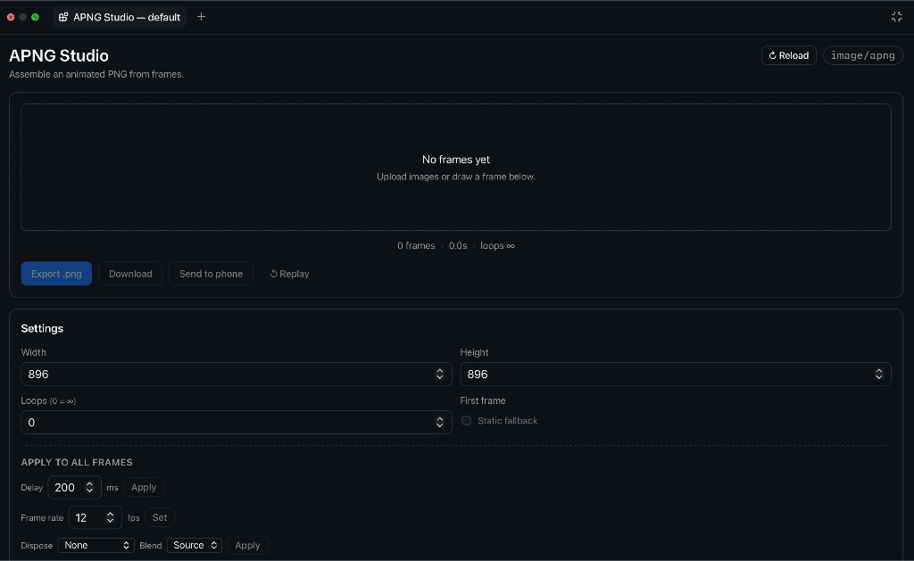

# APNG Studio

An interactive [GitHub Copilot app](https://github.com/features/ai/github-app) **canvas extension** for building [Animated PNG (APNG)](https://wiki.mozilla.org/APNG_Specification) files from frames — draw or upload frames, tune the full practical APNG spec surface, preview live, and export an animated `.png`.

The canvas renders in a side panel; the agent can also drive it through callable actions.

<p align="center">
  
</p>
<p align="center"><em>APNG Studio in action — an animated PNG built with the canvas itself.</em></p>

## Background

APNG Studio started as a hallway conversation. During a demo shift at the WeAreDevelopers Congress I got talking with [Jeff](https://github.com/GekkeBoyJeff) about APNG (animated PNG) versus GIF: APNG keeps real alpha and full color where GIF can't. We wanted an easy way to actually build one, so we made this small canvas wrapper for creating APNGs.

## Features

- **Frames** — upload images or draw them on a built‑in canvas (pen/eraser, fill, onion‑skin, "start from last frame"). Reorder, duplicate, and delete frames.
- **Per‑frame timing** — set the delay as an exact `numerator / denominator` fraction with a live `= N ms · N fps` readout.
- **Per‑frame compositing** — `dispose_op` (None / Background / Previous) and `blend_op` (Source / Over) dropdowns, straight from the APNG spec.
- **Apply to all** — set every frame's delay (ms), snap to an exact frame rate (fps), or apply dispose + blend in one click.
- **Loop count** — `0` = infinite, or a fixed number of plays.
- **Hidden first frame** — mark frame 1 as a static fallback: shown by non‑APNG viewers, excluded from the animation loop (encoded as a default image with no leading `fcTL`, `num_frames = N‑1`).
- **Live preview** — a real animated PNG is assembled on every change and served from `/preview.png`; a **Reload** button re‑syncs state and rebuilds the preview.
- **Send to phone** — a **Send to phone** button opens a QR code; scan it with your phone camera (same Wi‑Fi) to open the live animation in your phone's browser and save it. Served read‑only from a short‑lived, token‑gated LAN endpoint that shuts itself down after 10 minutes.
- **Export** — writes a valid animated `.png` (APNG) to disk and returns its path. The `.png` extension keeps the file byte‑compatible with every PNG viewer: APNG‑aware ones (browsers, macOS Quick Look) animate it, others show the first frame as a static fallback.

## Install

### From GitHub Copilot (recommended)

Ask Copilot to install the committed extension URL:

```text
Install this extension: https://github.com/github/awesome-copilot/tree/main/extensions/apng-studio
```

You can also copy the folder into one of these locations:

- **User** — `~/.copilot/extensions/apng-studio/`, available in every project.
- **Project** — `.github/extensions/apng-studio/` inside a repo, committed and shared with your team.

Reload extensions in the app, then open the `apng-studio` canvas.

### Manual

Copy the source files into one of the extension directories above, keeping the layout:

```
apng-studio/
├── extension.mjs      # entry point (required name)
├── apng.mjs           # APNG codec + RGBA→PNG encoder
├── qr.mjs             # dependency-free QR encoder (Send to phone)
└── web/               # canvas iframe renderer
    ├── index.html
    ├── app.js
    └── styles.css
```

Then reload extensions. The `@github/copilot-sdk` import is resolved by the host — **do not** add a `package.json` or `node_modules` for it.

## Open the canvas

Once installed, open the **APNG Studio** canvas from Copilot. Optional open input:

| field       | type   | description                                    |
| ----------- | ------ | ---------------------------------------------- |
| `projectId` | string | Animation project id (defaults to `default`).  |
| `name`      | string | Optional display name for the animation.       |

Each project's frames persist on disk under `artifacts/<projectId>/`, so they survive reloads and are shared between every open panel and the agent actions. That folder is local user data and is **git‑ignored**.

## Agent actions

The extension exposes these callable actions on the `apng-studio` canvas:

| action            | what it does                                                                                             |
| ----------------- | ------------------------------------------------------------------------------------------------------- |
| `get_state`       | Return project settings + per‑frame timing/compositing and total duration.                              |
| `set_settings`    | Update `width`/`height` (only with 0 frames), `loops`, and `hiddenFirst`.                               |
| `add_color_frame` | Append a solid‑color frame; accepts `delayNum`/`delayDen`/`disposeOp`/`blendOp`.                         |
| `set_frame`       | Update one frame (`frameId`) or all (`all: true`): timing via `delayMs`/`fps`/`delayNum`+`delayDen`, plus `disposeOp`/`blendOp`. |
| `clear_frames`    | Remove every frame.                                                                                      |
| `export`          | Assemble and write the animated `.png` (APNG) to disk; returns the absolute path.                        |

All actions accept an optional `projectId` to target a specific animation.

## How it works

- **`extension.mjs`** — one loopback HTTP server per open canvas instance serves the renderer, JSON state, per‑frame PNGs, the live `/preview.png`, and mutation endpoints. Server‑Sent Events (`/events`) push a `changed` signal so every open panel and the preview stay in sync. **Send to phone** spins up a separate, read‑only LAN server that serves only a landing page and the preview image, gated by a short‑lived random token and torn down on expiry.
- **`apng.mjs`** — assembles the APNG chunk stream (`IHDR` / `acTL` / `fcTL` / `IDAT` / `fdAT` / `IEND`) with contiguous sequence numbers, plus a minimal RGBA→PNG encoder.
- **`qr.mjs`** — a small, dependency‑free QR encoder (byte mode, error‑correction level M) used to render the **Send to phone** code. The QR is drawn into a PNG with the `apng.mjs` encoder.
- **`web/`** — the iframe UI. It talks to its server over plain HTTP; there is no privileged host bridge.

## License

[MIT](./LICENSE)
