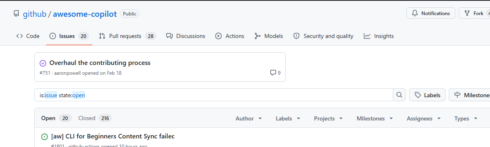

# Visual PR Plugin

When you change how something looks — a layout, a chart, a form — the PR description should show the change. Not describe it in words. Show it. A before/after screenshot tells your reviewer exactly what happened, and they don't have to check out the branch to see it.

This plugin teaches Copilot to capture screenshots of your web app (or any UI), annotate them with callouts, and embed them in the PR description. Once you get used to having up-to-date screenshots on every visual change, going back to text-only PRs feels like reviewing code with your eyes closed.

## Demo 🎬

It is 2009. You just added the feature to show labels on issues. You better include screenshots because this is huge.

Here is how such PR description would look like with our plugin:

> **Before** — issues list without labels:
>
> 
>
> **After** — labels are shown directly on each issue row:
>
> 

---

## It's not just for PRs

The same annotation engine works for any screenshot. Here's a single prompt:

> *"Go to the GitHub issues page of github/awesome-copilot. Screenshot the issues list and annotate: any issue icon, ready-for-review label, repo name, pinned issues, my avatar, most commented issue, New Issue button."*

The agent captured the page, identified 6 of 7 requested elements, and annotated them all. It correctly reported that the 7th (user avatar) isn't visible because the page was captured without authentication — no hallucinated annotations.

### Debug mode

Every annotation run can produce a debug heatmap showing how the algorithm chose label placements — contrast scoring, exclusion zones, and candidate rankings:

---

## Skills Included

| Skill | What it does |
|-------|-------------|
| [ui-screenshots](../../skills/ui-screenshots/SKILL.md) | Capture web UI screenshots with Playwright + PIL crop workflow |
| [image-annotations](../../skills/image-annotations/SKILL.md) | Annotate any image with callout rectangles, arrows, labels, and color-coded highlights |
| [pr-screenshots](../../skills/pr-screenshots/SKILL.md) | Embed before/after images in PR descriptions (GitHub + Azure DevOps) |
| [screen-recording](../../skills/screen-recording/SKILL.md) | Create annotated animated GIF demos with variable timing |

## Use Cases

- **Visual PRs** — show reviewers what changed without checking out the branch
- **Release notes** — embed GIF demos of new features
- **Bug reports** — before/after screenshots proving the fix
- **Documentation** — annotated screenshots with callouts highlighting key areas

## Requirements

This plugin needs a model that can view images — the workflow relies on looking at screenshots to find crop coordinates and verify annotations. The demo images in this README were generated with **Claude Opus 4.6**.
